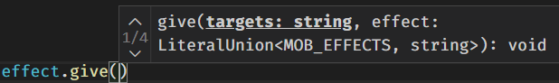
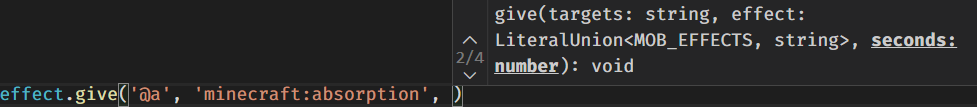

<div align="center"></div>

# Sandstone

  

Sandstone is a Typescript library for Minecraft Datapacks. It allows easy creation, debug and sharing of Minecraft functions, loot tables, predicates etc...

## Features

### Perfect autocompletion

Sandstone tells you what a command expects, and autocomplete complicated arguments for you.

You don't need to remember commands syntax anymore.


This autocompletion works for commands, predicates, loot tables, advancements...

*For the moment, autocompletion only works for commands.*

## Always up-to-date

Sandstone is divided in two parts. The core part is version-agnostic, and the commands part is *automatically generated* for each version of the game.
10 minutes after a new snapshot is released, Sandstone is already updated. You will always have access to **the latest commands**. Minecraft gets new blocks, enchantments, items, mobs? Sandstone knows it, and will autocomplete them for you.

*For the moment, Sandstone has not yet been splitted in two.*

## Easy to share
Sharing commands has **never been easier**. Just publish your functions on NPM, and everyone can use them to improve their own datapacks.

# Getting started

## Installation

The first step is to install [Node.JS](https://nodejs.org/en/). You will then need a code editor: I personnaly recommend [Visual Studio Code](https://code.visualstudio.com/Download).

Create an empty folder named "My Datapack", and run the following commands in order:

```bash
npm init
```

Answer the different questions (nothing of importance here). Then add the needed packages:

```bash
npm add typescript ts-node git+https://git@github.com/TheMrZZ/sandstone.git
npx tsc --init
```

You've now installed Sandstone, congratulations!

## Your first function

Let's write your first Minecraft function. Start VSCode, and open the folder you created. In the directory, create a new file named `helloworld.ts`, with the following content:
```js
import { say, mcfunction, saveDatapack } from 'sandstone'

mcfunction('hello', () => {
  say('Hello world!')
})

saveDatapack('My datapack', { verbose: true })
```
To run this file, type the following command in your terminal:

*Hint: to start a Terminal in VSCode, look at the top bar, click on Terminal > New Terminal.*


```bash
npx ts-node helloworld.ts
```

First, you should see the following output in your console:
```
===== default:hello =====
say Hello world!
=========================
```

Also, you should see a new folder in your current working directory, named `My datapack`. If you do, congratulations! You just wrote your first Minecraft function using Sandstone. You can explore your `My datapack` folder: you'll see it is a valid datapack, with your custom function in it!

### Explanation
Let's do a line-by-line explanation.

```js
import { say, mcfunction, saveDatapack } from 'sandstone'
```
This line tells Sandstone what we need to use. Here, we need one command, `say`, and two Sandstone functions, `mcfunction` and `saveDatapack`.


```js
mcfunction('hello', () => {...})
```
This line tells Sandstone we want to create a new mcfunction, called `hello`. We do not have to specify the namespace: here, the default namespace will be used. If you want, you can specify the namespace yourself, like you would in Minecraft: `mynamespace:hello`.
Inside the curly brackets `{...}`, we will specify the commands we want to write inside this mcfunction.

*For the moment, you cannot change the default namespace.*

```js
  say('Hello world!')
```
This line tells Sandstone that we want to write the `/say` command in the current mcfunction, with the `Hello world!` argument. It will result in the command `say Hello world!`.

```js
saveDatapack('My datapack', {
  verbose: true
})
```
This line tells Sandstone to save the all mcfunctions to the actual file system. Here, the first argument specifies the datapack's name. The second argument is the options. The `verbose` option allows you to display the resulting commands directly in your console, to ensure the result is correct. You'll learn how to save your datapack directly in Minecraft below.

*Note 1: one day, Sandstone will have its own CLI, and manual saving won't be required anymore.*

## How to write a command

### The basics

In Sandstone, all commands can directly be imported from `sandstone`:

```ts
import { advancement, execute, kill, say, scoreboard } from 'sandstone'
```

When typing a command or a subcommand, there are two possibilities:

* The command/subcommand has several subcommands, like `effect give|clear`. To access a subcommand, access it as a property: `effect.give` or `effect.clear`

* The command/subcommand has no subcommands. It directly has argument, like `enchant`. To specify the arguments, call it as a normal function: `enchant("@a", "minecraft:sharpness")`

A command can have multiple subcommands, which all have arguments: `effect.give('@a', 'minecraft:speed', 30, 2)` or `effect.clear('@a', 'minecraft:night_vision')`.

**Important**: A command is only written to the datapack if it has been called. For example, some commands do not have any arguments, like `/reload`. In Sandstone, you'd have to type `reload()`. Only typing `reload` will **not** call the command, and nothing will appear in your datapacK.

### Optional arguments

In Minecraft, some commands have optional arguments. Let's stay with the `/effect give` command. According to the [Wiki](https://minecraft.gamepedia.com/Commands/effect#Syntax), It has 2 to 5 arguments:

```/effect give <targets> <effect> [<seconds>] [<amplifier>] [<hideParticles>]```

As you can see, the `targets` and the `effect` arguments are **mandatory**. Minecraft doesn't know what to do if you do not provide them. However, the `seconds`, `amplifier` and `hideParticles` arguments are all optionals. If you do not specify them, Minecraft uses default values.

In this aspect, Sandstone is identical to Minecraft. When typing `effect.give()`, your IDE will show you the possible arguments:


On the left, you can see there are 4 different ways to call `effect.give`. The first one is shown here: you can just give a target and an effect, and Minecraft will be happy. If you type them and try to enter a **third** argument, your IDE will automatically show the next possible argument:
.

It's telling you the third argument is the number of seconds. If you keep going (or type the Down arrow to display all possibilities), you will see that Sandstone allows what Minecraft allows. It's very useful: **you don't have to remember the syntax of all commands**, Sandstone does that for you.

### Execute

Sandstone has a special syntax for the `/execute` command. At its core, it looks just like Minecraft:

```js
execute.as("@a").at("@s")
```

The divergent part is the command call:

```js
// Sets a block of dirt under all players
execute.as("@a").at("@s").setblock('~ ~-1 ~', 'minecraft:dirt')
```

This will result in `execute as @a at @s run setblock ~ ~-1 ~ minecraft:dirt`. As you can see, you **don't specify the run subcommand**. It is automatically infered.

However, the `run` subcommand still exists, but it is used to execute *several commands*:

```js
execute.as("@a").at("@s").run(() => {
  // All this commands are executed "as @a at @s".
  // Sets a block of dirt under all players, and air on their body & head.
  setblock('~ ~-1 ~', 'minecraft:dirt')
  setblock('~ ~ ~', 'minecraft:air')
  setblock('~ ~1 ~', 'minecraft:air')
})
```

If you try running such commands, under a mcfunction named "main" with verbose saving, you'll have the following results:

```
==== default:main ====
execute as @a at @s run function default:main/execute_as
================

==== default:main/execute_as ====
setblock ~ ~-1 ~ minecraft:dirt
setblock ~ ~ ~ minecraft:air
setblock ~ ~1 ~ minecraft:air
================
```

As you can see, Sandstone automatically created a new mcfunction for you. It contains all your nested commands (all the setblocks), and is called by the `execute` command. Therefore, you achieve the desired effect **without managing several files youself**.

## Saving the datapack

Using sandstone, you can choose to either save the datapack to the current directory, or to save it directly in one of your Minecraft world. The first argument to the `saveDatapack` method is the name of the datapack. If you only provide this argument, the datapack will be saved to your current directory.

```js
// Save the datapack to the current directory
saveDatapack('My datapack')
```

As a second argument, `saveDatapack` accepts options. They are listed below.
|               | |
|---------------|-|
| verbose       | If true, the resulting commands will be displayed in the console. |
| world         | The name of the world to save your datapack into. If left unspecified, the datapack will be saved in the current directory. |
| minecraftPath | The location of the .minecraft folder. If left unspecified, it will be automatically discovered. |

As you can see, Sandstone can save your datapack directly in one of your world:
```js
// Save the datapack in "An awesome world"
saveDatapack('My datapack', {
  world: 'An awesome world'
})
```

To achieve this, Sandstone automatically detects where your `.minecraft` folder is located. If you modified your `.minecraft` location, Sandstone could fail to find it. In that case, Sandstone will give you a clear error message. You will then have to manually specify your `.minecraft` location:
```js
// Save the datapack in "An awesome world", in a custom .minecraft folder
saveDatapack('My datapack', {
  world : 'An awesome world',
  minecraftPath: 'C:/Program Files/.minecraft'
})
```

Sometimes, you might want direct feedback on the functions you're writing. The `verbose` option will display all functions & commands in your console.
```js
mcfunction('hello', () => {
  say('Hello world!')
})

saveDatapack('My datapack', {
  verbose: true
})

/** Console output:
 *
 * ===== default:hello =====
 * say Hello world!
 * =========================
 */
```

## Minecraft Functions

### Create a Minecraft function

As you saw earlier, you can create a Minecraft function using `mcfunction`:

```js
// Create a Minecraft function inside the default namespace, named "main.mcfunction"
mcfunction('main', () => {...})
```

By specifying only the function's name, it will be created inside the default namespace. However, you can specify it yourself:
```js
// Create a Minecraft function inside the `mydatapack` namespace, named "main.mcfunction"
mcfunction('mydatapack:main', () => {...})
```

Here, your function will be created inside the `mydatapack` namespace.

### Calling a Minecraft function

One of the goal of Sandstone is to promote reusable block of commands. To make this possible, you have the ability to call other functions.

Your first possibility is to call another Minecraft function, just like you would in a normal Minecraft Datapack. To achieve this, you need to assign your mcfunction to a variable:

```js
const main = mcfunction('main', () => {
  say("This is the main function.")
  give('@a', 'minecraft:diamond')
})

mcfunction('callMainThreeTimes', () => {
  main()
  main()
  main()
})
```

This will result in the following functions:
```
===== default:main =====
say This is the main function
give @a minecraft:diamond
========================

===== default:callMainThreeTimes =====
function default:main
function default:main
function default:main
======================================
```

This approach has several advantages:

* Commands are not duplicated. This results in a lighter datapack.

* The function can be recursive.

* It has a meaningful name in Minecraft (here, default:main).

However, it has three drawbacks:

1. It will create a `.mcfunction` file, even if it's never called. Therefore, it makes it hard to share your functions with other peoples: if your library contains 100 helper functions, all datapacks using your library will include those 100 functions - even if they only use one.

2. It cannot take parameters. If you want to have a generic function, this is not possible.

The first drawback can be solved using **lazy functions**, and the second one using **parametrized functions**.

### Lazy Minecraft Functions

To prevent Sandstone creating functions when not mandatory, you can use lazy functions. A lazy function will be created **only if another function calls it**. A lazy function that isn't called won't even be present in the datapack:
```js
const useless = mcfunction('useless', () => {
  say('This function is not used anywhere')
}, { lazy: true })

mcfunction('main', () => {
  say('Main function')
})
```
Results in:
```
===== default:main =====
say Main function
========================
```

As you can see, the `useless` function has not been created. Let's call it from the `main function`:
```js
const useless = mcfunction('useless', () => {
  say('This function is not used anywhere')
}, { lazy: true })

mcfunction('main', () => {
  say('Calling "useless"...')
  useless()
})
```
Results in:
```
===== default:main =====
say Calling "useless"...
function default:useless
========================

===== default:useless =====
say This function is not used anywhere
===========================
```

As you can see, the `useless` function has been created, because it is called from `main`. This feature is very useful to distribute lot of functions.

### Parametrized Minecraft functions


# Contributing

For the moment, Sandstone is not opened to external contributions *(honestly, I don't know how to do that)*. However, feel free to open Issues, or to contact @TheMrZZ#9307 on the [Minecraft Commands Discord](https://discord.gg/9wNcfsH) for discussing this project!
